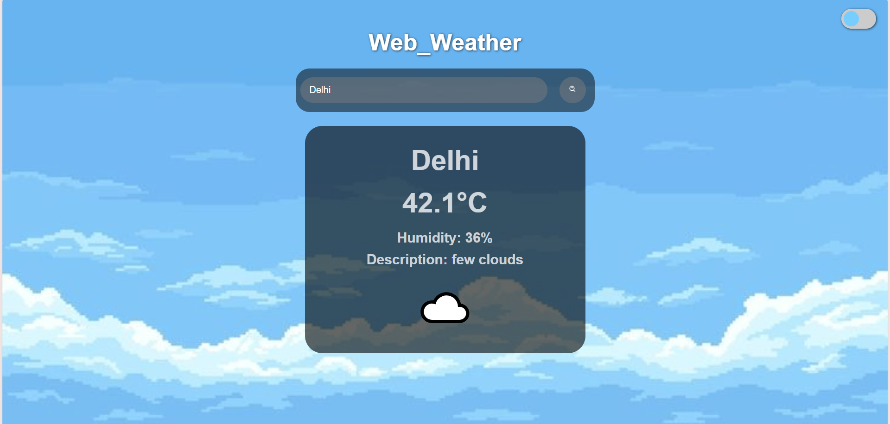
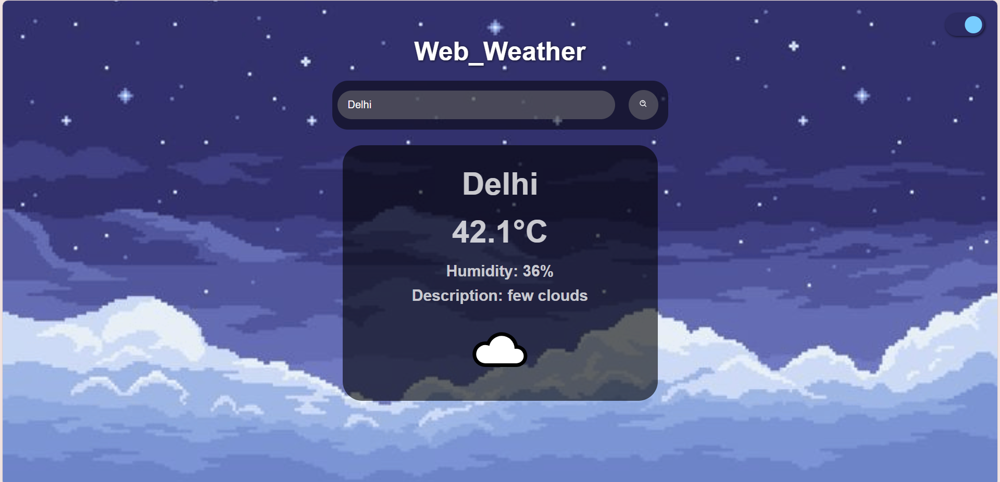

# Web_Weather☁️

Web_Weather is a simple weather web app that lets you search and view real-time weather updates for any city in the world. Built using HTML, CSS, and JavaScript with the OpenWeatherMap API.

---

## 🌦 Features

- Real-time city weather search
- Temperature, humidity, and wind speed display
- Day/Night modes
- Responsive design
- Weather condition icons
---

## Tech Stack

- HTML5
- CSS3
- JavaScript
- [OpenWeatherMap API](https://openweathermap.org/api)
---

## 📸 Screenshots

### Day Mode  


### Night Mode  


---

## Setup & Installation

1. Clone this repo:
   ```bash
   git clone https://github.com/your-username/web_weather.git
   cd web_weather
   ```
    or download the .zip and extract it manually.

2. To make the search work, add your OpenWeatherMap API key to the JavaScript file:

    ```
    const apiKey = "YOUR_API_KEY_HERE";
    ```
    
3. Run the project:

- Simply open index.html in your browser
- Enter a city name to see its weather instantly
---
## Author

Developed by [@aayushirh](https://www.instagram.com/aayushirh/).

Feel free to contribute or report issues to help improve the project.
